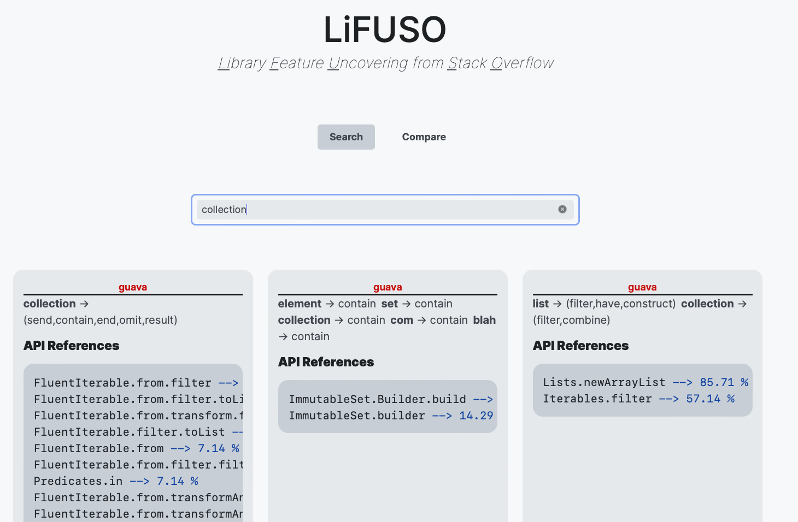
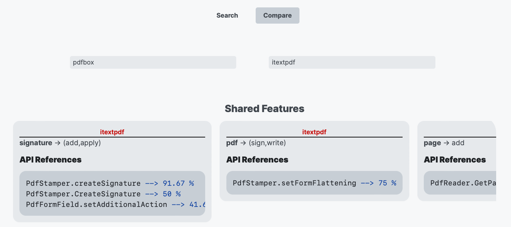

LiFUSO is a web tool which allows the feature exploration for libraries in a software ecosystem such as Maven.

The features extracted for each library can be visualised and the libraries can be further compared feature-wise.

You can see a short video of the tool in action here: [https://youtu.be/tDE1LWa86cA](https://youtu.be/tDE1LWa86cA).

## Setup

Make sure to install the dependencies executing one of the following commands:

```bash
# yarn
yarn install

# npm
npm install
```

## Development Server

Start the development server on http://localhost:3000 and begin your feature exploration:

```bash
npm run dev
```

## Feature exploration and library comparison

Once the libraries are installed and the server deployed, please access the localhost on the port 3000 (http://localhost:3000) (if not previously in use) and you should be able to see the following screen on your browser:



Two tabs, **Search** and **Compare**, define the current functionalities of the application, being **Search** the one activated by default.

The search box below the tabs allows searching by introducing natural language terms in the box. Some examples of searches are:
* `collection` (displays all features related to collections)
* `filter collection` (displays features with a specific action on the collections)
* `create chart` (displays features that enable the creation of charts)
* `extract image` (displays features about image extraction)
* ...

Features (rectangular items in a grid) are randomly displayed below the search box. Each feature is described by the library it belongs to (in red at the top of the card), its name (the natural language terms below the library) and the most frequent API references in a cluster of API usages from Stack Overflow code snippets. This frequency is shown in percentage numbers next to the references. 

The **Compare** tab (screenshot below) allows the exploration of shared features by two libraries (for the moment) and the unique features each of the libraries in comparison have with respect to each other.



The two combo boxes in this screen allow the selection of one available library in the system. There are currently seven libraries to choose from, namely: `guava`, `pdfbox`, `itextpdf`, `jsoup`, `httpclient`, `poi-ooxml` and `quartz`. Once the libraries are selected, shared features will be automatically displayed below, followed by the unique features of each of the libraries in comparison. Shared and unique features can be explored by scrolling either in the left or right directions in each of the sections.

